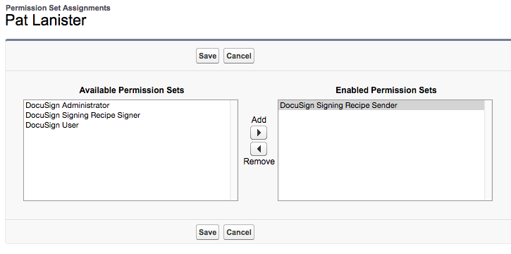
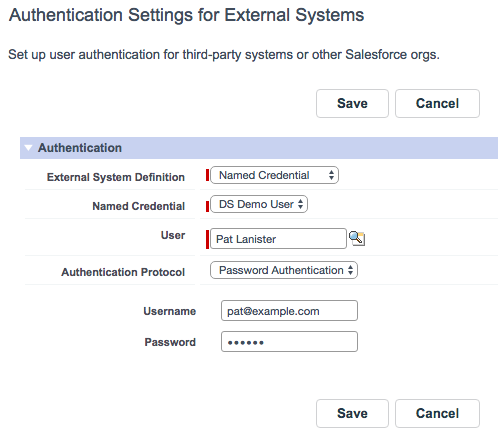
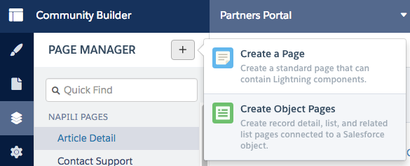

  

Installing Signing Objects Recipe

The package includes the recipe's SFDC objects, code, permission sets and other content.

* Goto the repo
* Click **Deploy to Salesforce**

  (addthe real button here!!)

  
  
* The next screen shows the repo information. Click **Login to Salesforce**

  

* Approve access to your Salesforce instance from the deploy tool: Click **Alow**
  

~~~~~~~~~~~~~

Install the unmanaged package

It includes the named credentials

### Add your Service Integration credentials to the Named Credential **DS Demo Integration User**
It is used for the signers.

### Assign Permission Sets to the users

Settings / Users

Add to the **Sender** users:
Open their user record.
Goto the **Permission Set Assignments** section. Click **Edit Assigments**

Use the right Permission set section!
  

Add **DocuSign Signing Recipe Sender** and Signer to the right people.
  
Note: Sender permission includes Signer permission

### Each Sender enters their own DocuSign username / pw

Setup / Users
Open a sender.
Go to section **Authentication Settings for External Systems**
Clock **New**

Named Credential: DS Demo User

* Choose the user (admins can set the info for their users)
* Enter your DocuSign username and password
  
* Save

### Add account ID and Integration Key
Settings / custom meta. Choose **Custom Metadata Types**

Click **Manage Records** for the **DocuSign Signing Recipe Integration** item

Click **Edit** on the **Default** record

Fill in the account ID and Integration Key
The Named Credential API Name default is good.

### Create a new Signing Request
Must switch to Lightning Experience to Send
Click App Launcher

Then Click DocuSign Signing Recipe
  
  
Open the records
Click **New**

The **Create Signing Request** modal opens
Fill it in 

Add the details of what to enter and not enter.

Hit Save.
The envelope is created on DocuSign.

### Signers

Community Builder
(See timemark 40 on recording)
Click on Page Editor (second on left) 
Click on the nav bar (Topics) on the page, so you can edit it
Click **Edit Navigation Menu** on right side
Click **Add Menu Item**
  

Click **Publish Changes**

Goto Page Manager (3rd icon)
Click + Icon and choose **Create Object Pages**
  

Choose **Signing Request**  (not DocuSign Signing)
Click **Create**

Click on the **Signing Request Detail** page
Your are in the Signing Request Detail page. 
Click **Edit**

You're in the page editor for the page.
Change **Page Layout** on right: click **Change Layout**
Choose 2 columns with 2:1 ratio
  
Click Change

### Add the componet to the page
On left, list of components.
Under custom components: Signing Request Sign Button
time 54
WIden the page to see the **Add components to this region (Sidebar)
  
drag the compnent to the sidebar region of the page

Properties: set community url
Copy the text from the All Communities record
  
### To remove the feed
Select the detail record
Then on properties change **Tabe 3 Type** from **Feed** to **None**

Click **Publish**

  
  
  

